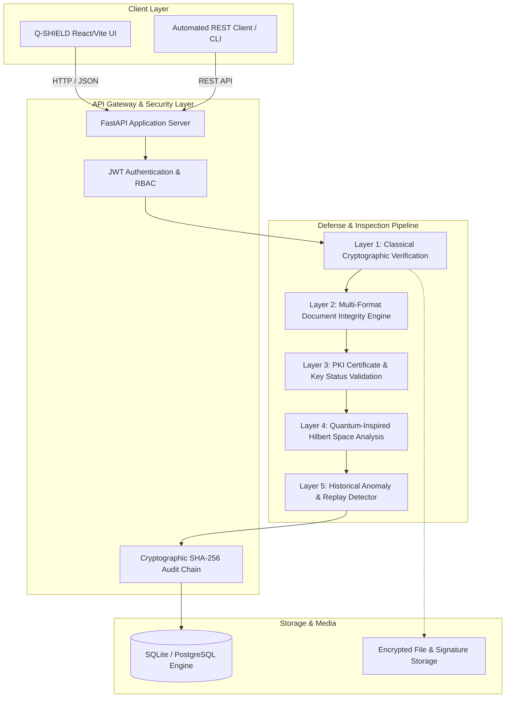
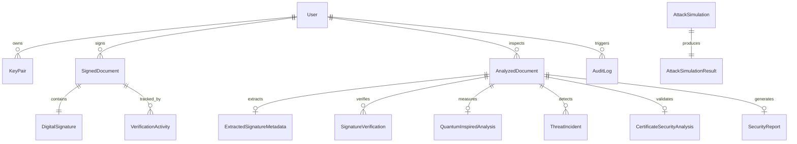

# Q-SHIELD System Architecture

## 1. Architectural Overview

Q-SHIELD (Quantum-Inspired Cyber Threat Detection for Digital Signature Security) is an enterprise-grade cybersecurity platform engineered for real-time detection, analysis, and mitigation of digital signature compromises.

The platform uniquely combines **strict classical public-key cryptography (PKI/RSA/X.509)** with a **100% deterministic, zero-AI/ML quantum-inspired mathematical analytical core** operating on state vectors in Hilbert space.



---

## 2. Five-Layer Defensive Inspection Pipeline

Every document submitted for inspection undergoes a strict, deterministic 5-layer validation:

```
                      Uploaded Document / Signature Package
                                       │
                                       ▼
┌─────────────────────────────────────────────────────────────────────────────┐
│ Layer 1: Classical Cryptographic Verification                               │
│ • RSA-SHA256 mathematical signature verification (PKCS#1 v1.5)             │
│ • PyHanko ISO 32000-1 / PKCS#7 CMS verification for PDF signatures         │
│ • User-specific RSA key pair or X.509 certificate validation                │
└──────────────────────────────────────┬──────────────────────────────────────┘
                                       │
                                       ▼
┌─────────────────────────────────────────────────────────────────────────────┐
│ Layer 2: Document Integrity & Format Engine                                 │
│ • SHA-256 content digest computation                                        │
│ • Format detection (PDF, TXT, canonical JSON, detached signatures)          │
│ • Comparison against registered hash in database & signature envelope       │
└──────────────────────────────────────┬──────────────────────────────────────┘
                                       │
                                       ▼
┌─────────────────────────────────────────────────────────────────────────────┐
│ Layer 3: PKI & Certificate Security Validation                              │
│ • Certificate validity dates (not_before, not_after)                        │
│ • Public key fingerprint validation and issuer trust verification          │
│ • Certificate serial number and subject attribute tracking                  │
└──────────────────────────────────────┬──────────────────────────────────────┘
                                       │
                                       ▼
┌─────────────────────────────────────────────────────────────────────────────┐
│ Layer 4: Quantum-Inspired Mathematical Core                                 │
│ • Projection onto 2D Hilbert space basis {|0>, |1>}                         │
│ • Parameter extraction into normalized security state vector |ψ>            │
│ • Pauli matrix perturbation analysis (σ_x bit-flip, σ_z phase-flip)         │
│ • Projective measurement via Born's rule: P(Secure) = |<0|ψ>|^2             │
│ • Quantum state disturbance D(|ψ_exp>, |ψ_obs>) & fidelity F calculation    │
│ • 100% deterministic mathematical calculations — NO AI / NO ML              │
└──────────────────────────────────────┬──────────────────────────────────────┘
                                       │
                                       ▼
┌─────────────────────────────────────────────────────────────────────────────┐
│ Layer 5: Historical Threat & Replay Intelligence                            │
│ • Sliding-window frequency analysis across recent verification events       │
│ • Detection of rapid duplicate submissions (Replay Attack threshold)        │
│ • Composite risk calculation (0 to 100) & categorical threat classification │
└──────────────────────────────────────┬──────────────────────────────────────┘
                                       │
                                       ▼
                      Synthesized Security Assessment
                     (Decision, Risk Score, Audit Log)
```

---

## 3. Database Schema Relationships

Q-SHIELD maintains relational data integrity across core entities:



### Entity Responsibilities

1. **`User`**: Role-based identities (`SUPER_ADMIN`, `SECURITY_ANALYST`, `DIGITAL_SIGNATURE_USER`, `GUEST`).
2. **`KeyPair`**: Stores RSA-2048 public keys (PEM) and Fernet-encrypted private keys.
3. **`SignedDocument`**: Canonical registry of signed documents with original SHA-256 hash, signature value, algorithm, and timestamps.
4. **`AnalyzedDocument`**: Master record for every file or payload submitted for inspection.
5. **`ExtractedSignatureMetadata`**: Parsed digital signature headers, field names, signer names, certificate details.
6. **`SignatureVerification`**: Cryptographic verification outcomes, integrity status, and diagnostic messages.
7. **`QuantumInspiredAnalysis`**: State vector coordinates, consistency score, Pauli disturbance metrics, and Born probabilities.
8. **`ThreatIncident`**: Detailed security anomalies (`DOCUMENT_TAMPERING`, `FORGERY`, `REPLAY_ATTACK`, `IMPERSONATION`).
9. **`SecurityReport`**: Comprehensive audit reports with deterministic recommendations and reference codes (`QSHIELD-REPORT-XXXXXXXX`).
10. **`AuditLog`**: Cryptographically chained tamper-evident event journal (`current_log_hash = SHA256(prev_hash + event_data)`).

---

## 4. Tamper-Evident SHA-256 Audit Log Chain

Every security event writes a record to `audit_logs`. The log entry is cryptographically bound to the immediately preceding log entry:

$$\text{current\_log\_hash} = \text{SHA256}(\text{log\_id} \parallel \text{event\_id} \parallel \text{user\_email} \parallel \text{action} \parallel \text{result} \parallel \text{details} \parallel \text{previous\_log\_hash} \parallel \text{timestamp})$$

Any retroactive manipulation of audit details or unauthorized deletion breaks the hash pointer chain, instantly raising an `AUDIT_LOG_INTEGRITY_WARNING` upon verification.

---

## 5. Technology Stack

- **Backend Framework**: Python 3.11+ / FastAPI (high-concurrency async REST API)
- **Database**: SQLite (Local Dev / Portable Demo) / PostgreSQL (Production)
- **ORM & Migrations**: SQLAlchemy 2.0+
- **Cryptographic Engines**:
  - `cryptography` (RSA, PKCS#1 v1.5, X.509, SHA-256, Fernet)
  - `pyhanko` (ISO 32000-1 PDF digital signature and CMS verification)
  - `reportlab` (deterministic PDF report compilation)
- **Quantum-Inspired Math**: NumPy (Hermitian operators, tensor products, state vector normalization)
- **Frontend Framework**: React 18, TypeScript, Tailwind CSS, Lucide Icons, Vite
- **Deployment**: Docker, Docker Compose, Nginx Reverse Proxy
