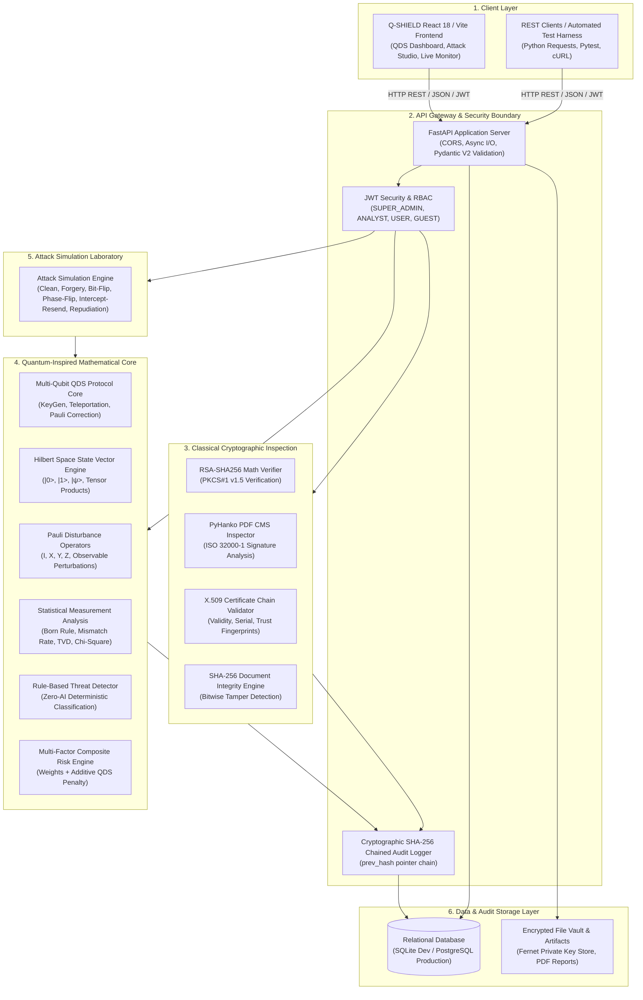
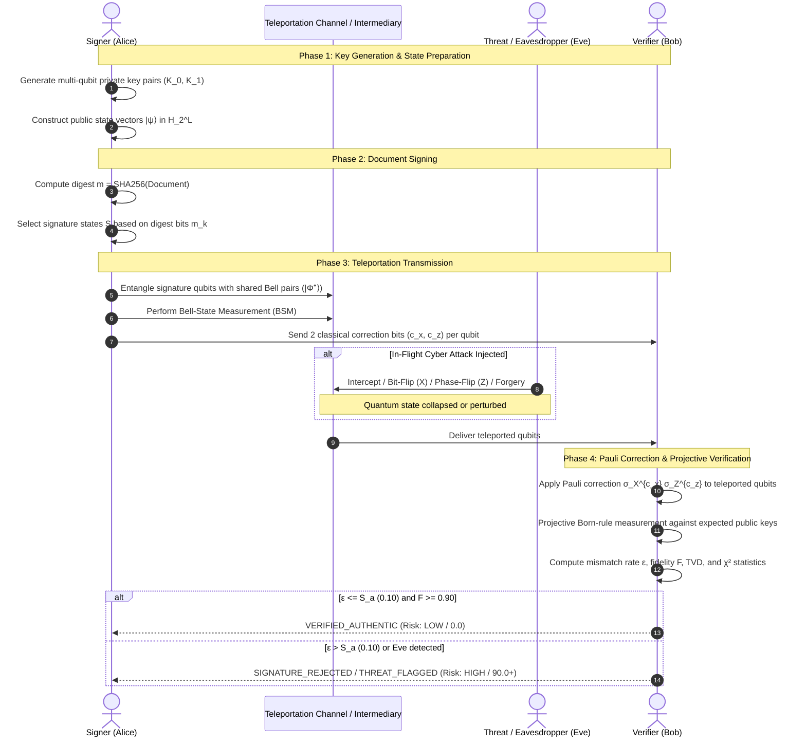
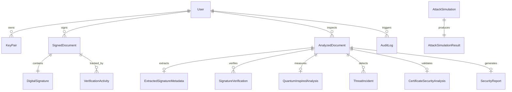

# Q-SHIELD System Architecture

## 1. Architectural Overview & System Design

Q-SHIELD (**Quantum-Inspired Cyber Threat Detection for Digital Signature Security**) is an enterprise cybersecurity and cryptographic threat detection platform. It is engineered to detect, classify, and mitigate cyber threats targeting digital signatures across both classical public-key infrastructure (PKI/RSA/X.509) and multi-qubit teleportation-based Quantum Digital Signature (QDS) protocols.

The architecture combines two complementary pillars:
1. **Classical Cryptographic Engine**: RSA-2048 (PKCS#1 v1.5), SHA-256 digests, and PyHanko ISO 32000-1 CMS validation.
2. **Quantum-Inspired Mathematical Core**: 100% deterministic linear algebra over complex Hilbert space $\mathcal{H}_2^{\otimes n}$, Bell-state entanglement, quantum teleportation simulation, Pauli disturbance operators ($\sigma_X, \sigma_Y, \sigma_Z$), projective Born-rule measurements, and statistical goodness-of-fit testing ($\text{TVD}, \chi^2$).



---

## 2. Backend Architecture

The backend is built with **FastAPI** (Python 3.11+) following clean layered separation between presentation (routes), data transfer (schemas), business logic (services and engines), and persistence (models):

```
backend/
├── app/
│   ├── api/
│   │   ├── deps.py                 # Dependency injection: get_db, get_current_user, RBAC roles
│   │   └── v1/
│   │       ├── router.py           # Master API v1 router aggregation
│   │       └── endpoints/
│   │           ├── auth.py         # Login, JWT token generation, user profiles
│   │           ├── verify.py       # Classical document verification & analysis
│   │           ├── qds.py          # 8 REST endpoints for multi-qubit QDS operations
│   │           ├── attacks.py      # Classical attack simulation workflows
│   │           ├── threats.py      # Incident intelligence & threat queries
│   │           ├── audit.py        # Cryptographic audit chain verification & queries
│   │           └── documents.py    # Document management & file uploads
│   ├── core/
│   │   ├── config.py               # Environment configuration & application settings
│   │   ├── security.py             # Password hashing (bcrypt) & JWT decoding
│   │   └── qds_engine.py           # Multi-Qubit QDS mathematical protocol engine
│   ├── models/                     # SQLAlchemy 2.0 ORM database entities
│   │   ├── user.py                 # User identity, hashed credentials, and roles
│   │   ├── document.py             # Uploaded/signed documents & metadata
│   │   ├── verification.py         # Verification runs, classical & quantum metrics
│   │   ├── threat.py               # Threat incidents, classifications, and severities
│   │   └── audit.py                # Tamper-evident chained audit journal entries
│   └── schemas/                    # Pydantic v2 data validation models
│       ├── qds.py                  # Schemas for all 8 QDS request/response payloads
│       ├── verification.py         # Request/response schemas for classical inspection
│       └── ...
└── quantum_engine/                 # Pure mathematical quantum-inspired library
    ├── states.py                   # State vectors, normalization, tensor products
    ├── bell_states.py              # 4 maximally entangled Bell states & Bell basis
    ├── pauli_operations.py         # Pauli matrices, disturbance operators, observable flips
    ├── metrics.py                  # Quantum state fidelity F, state disturbance D, distance
    ├── measurement_analysis.py     # Born-rule projective measurements, TVD, Chi-square
    ├── risk_engine.py              # Deterministic composite risk calculation & QDS penalty
    └── threat_detector.py          # Threat taxonomy classification & severity mapping
```

### Key Architectural Tenets of the Backend:
- **Stateless REST Protocol**: All QDS endpoints accept complete state objects or parameters and return complete verification outcomes, allowing reproducible execution and horizontal scalability.
- **Strict Role-Based Access Control**:
  - `SUPER_ADMIN`: System-wide access, audit verification, full attack orchestration.
  - `SECURITY_ANALYST`: QDS execution, attack simulation, risk inspection, threat analytics.
  - `DIGITAL_SIGNATURE_USER`: Key generation, signing, teleportation, self-verification.
  - `GUEST`: Health and threshold metadata viewing.
- **Fail-Safe Determinism**: No random ML seeds or stochastic neural inferences. Given identical input keys and state vectors, all quantum metrics, statistical tests, and risk scores produce identical outcomes.

---

## 3. Quantum Engine Architecture

The quantum-inspired engine (`backend/quantum_engine/`) is implemented purely in **NumPy** using complex numerical linear algebra:

```
┌────────────────────────────────────────────────────────────────────────┐
│                      backend/quantum_engine/                           │
├──────────────────────────┬─────────────────────────────────────────────┤
│ Module                   │ Mathematical Responsibilities               │
├──────────────────────────┼─────────────────────────────────────────────┤
│ states.py                │ • Computational basis states |0>, |1>       │
│                          │ • Complex state normalization: ||ψ|| = 1    │
│                          │ • Arbitrary superposition initialization    │
│                          │ • Tensor product combinations: |ψ₁⟩ ⊗ |ψ₂⟩  │
├──────────────────────────┼─────────────────────────────────────────────┤
│ bell_states.py           │ • Four canonical Bell states:               │
│                          │   |Φ⁺⟩, |Φ⁻⟩, |Ψ⁺⟩, |Ψ⁻⟩                     │
│                          │ • Bell projection operators                 │
│                          │ • Bell-basis joint measurement decomposition │
├──────────────────────────┼─────────────────────────────────────────────┤
│ pauli_operations.py      │ • Pauli matrices σ_I, σ_X, σ_Y, σ_Z         │
│                          │ • Bit-flip disturbance injection            │
│                          │ • Phase-flip disturbance injection          │
│                          │ • Observable measurement expectation values │
├──────────────────────────┼─────────────────────────────────────────────┤
│ metrics.py               │ • Quantum state fidelity: F = |⟨ψ₁|ψ₂⟩|²    │
│                          │ • Disturbance: D = 1 - F                    │
│                          │ • Trace distance between density matrices   │
├──────────────────────────┼─────────────────────────────────────────────┤
│ measurement_analysis.py  │ • Projective measurement simulation         │
│                          │ • Mismatch rate calculation                 │
│                          │ • Total Variation Distance (TVD)            │
│                          │ • Chi-Square Goodness-of-Fit (χ²) analysis  │
│                          │ • P-value determination (scipy.stats)       │
├──────────────────────────┼─────────────────────────────────────────────┤
│ risk_engine.py           │ • Multi-factor weighted classical risk      │
│                          │ • Additive QDS penalty calculation          │
│                          │ • Dynamic severity classification           │
├──────────────────────────┼─────────────────────────────────────────────┤
│ threat_detector.py       │ • Rule-based threat classification          │
│                          │ • Anomaly evidence correlation              │
│                          │ • Classical + QDS incident synthesis        │
└──────────────────────────┴─────────────────────────────────────────────┘
```

---

## 4. Multi-Qubit QDS Protocol Workflow Architecture

The teleportation-based Quantum Digital Signature workflow operates across three logical stages:
1. **Key Distribution**: Generation of quantum private keys and corresponding public state vectors.
2. **Signature Creation**: Binding the classical document hash (SHA-256) to multi-qubit states.
3. **Teleportation & Verification**: Quantum teleportation of the signature qubits via shared Bell pairs, followed by Pauli correction, projective measurement, and threshold validation.



### Teleportation Protocol Detail:
- For each signature qubit $|\psi\rangle = \alpha|0\rangle + \beta|1\rangle$:
  1. Alice and Bob share an entangled Bell pair $|\Phi^+\rangle = \frac{1}{\sqrt{2}}(|00\rangle + |11\rangle)$.
  2. The combined 3-qubit state is $|\psi\rangle \otimes |\Phi^+\rangle$.
  3. Alice measures her two qubits in the Bell basis, obtaining one of four outcomes:
     - Outcome `00` ($|\Phi^+\rangle$): Bob's qubit is $I|\psi\rangle$.
     - Outcome `01` ($|\Psi^+\rangle$): Bob's qubit is $\sigma_X|\psi\rangle$.
     - Outcome `10` ($|\Phi^-\rangle$): Bob's qubit is $\sigma_Z|\psi\rangle$.
     - Outcome `11` ($|\Psi^-\rangle$): Bob's qubit is $\sigma_X\sigma_Z|\psi\rangle = -i\sigma_Y|\psi\rangle$.
  4. Alice sends the 2 classical bits $(c_x, c_z)$ to Bob.
  5. Bob applies the Pauli correction operator $\sigma_X^{c_x} \sigma_Z^{c_z}$ to restore the exact state $|\psi\rangle$.
  6. Any unauthorized interception, bit-flip, or phase-flip alters the state vector, degrading fidelity $F$ and driving the measurement mismatch rate $\epsilon$ above the verification threshold $S_a$.

---

## 5. Threat Detection & Risk Evaluation Pipeline

Threat detection in Q-SHIELD is deterministic, combining classical signals with quantum statistical indicators:

```mermaid
flowchart LR
    subgraph Inputs["1. Raw Cryptographic & Quantum Inputs"]
        CSig["Classical Signature Result"]
        Integrity["SHA-256 Digest Match"]
        CertSig["X.509 Certificate Validity"]
        ReplaySig["Timestamp & Velocity Anomaly"]
        QStates["Teleported Qubit States"]
    end

    subgraph StatLayer["2. Statistical Analysis Engine"]
        FidMetric["State Fidelity F = |<ψ1|ψ2>|^2\nDisturbance D = 1 - F"]
        MismatchMetric["Mismatch Rate ε = (Count of Mismatches) / L"]
        TVDMetric["Total Variation Distance\nTVD = 0.5 * Σ |P_obs - P_exp|"]
        Chi2Metric["Chi-Square Goodness-of-Fit\nχ² = Σ (O - E)² / E, p-value"]
    end

    subgraph DetectionLayer["3. Threat Classifier (Rules)"]
        ForgDetect["FORGERY\n(ε > 0.35, F < 0.65)"]
        BitDetect["BIT_FLIP_ATTACK\n(σ_X disturbance, ε ~ 0.50)"]
        PhaseDetect["PHASE_FLIP_ATTACK\n(σ_Z disturbance in X-basis)"]
        EveDetect["INTERCEPT_RESEND\n(Measurement collapse, ε ~ 0.25)"]
        RepudDetect["REPUDIATION\n(|ε_Bob - ε_Charlie| > S_v)"]
    end

    subgraph ScoringLayer["4. Multi-Factor Risk Engine"]
        WeightedSum["Weighted Classical Base Score\n(Weights: Sig 0.25, Integrity 0.25, etc.)"]
        QDSPenalty["Additive QDS Penalty c_QDS\n(+20.0 * (ε - Sa)/(1 - Sa) if ε > 0.10)\n(+10.0 * min(1, D/0.50) if D >= 0.20)"]
        ScoreClamp["Composite Risk Score\n[0.0 to 100.0]"]
    end

    Inputs --> StatLayer
    StatLayer --> DetectionLayer
    StatLayer --> ScoringLayer
    DetectionLayer --> ScoringLayer
    ScoringLayer --> FinalAssess["Final Security Assessment\n(Decision, Severity, Audit Log)"]
```



### Composite Risk Engine Mathematical Formulation:

$$\text{Composite Risk} = \min\left(100.0, \; \sum_{i} \frac{w_i \cdot r_i}{\sum_k w_k} + c_{\text{QDS}}\right)$$

#### Classical Component Weights:
- Classical Signature Validity: $w = 0.25$
- Document Integrity (SHA-256 match): $w = 0.25$
- Public Key Verification: $w = 0.10$
- Certificate Validity: $w = 0.08$
- Replay Velocity Analysis: $w = 0.08$
- User Activity Baseline: $w = 0.06$
- State Disturbance Metric: $w = 0.08$
- Pauli Disturbance Metric: $w = 0.05$
- Quantum Forgery Estimate: $w = 0.05$

#### Additive QDS Penalty ($c_{\text{QDS}}$):
If the QDS measurement mismatch rate $\epsilon$ exceeds the verification threshold $S_a = 0.10$:
$$c_{\text{mismatch}} = 20.0 \times \frac{\epsilon - S_a}{1.0 - S_a}$$
*(If $\epsilon \ge 0.40$, a minimum floor of $85.0$ is enforced).*

If the quantum state disturbance $D \ge 0.20$:
$$c_{\text{disturbance}} = 10.0 \times \min\left(1.0, \; \frac{D}{0.50}\right)$$
*(If $D \ge 0.50$, a minimum floor of $80.0$ is enforced).*

---

## 6. Attack Simulation Architecture

Q-SHIELD provides a dedicated attack simulation lab (`POST /api/qds/simulate-attack` and frontend Attack Studio) that models realistic adversarial scenarios:

| Attack Type | Quantum / Cryptographic Mechanism | Expected Observables | Detection Threshold |
| :--- | :--- | :--- | :--- |
| **`none` (Clean Baseline)** | Flawless Bell teleportation, noiseless channel | Mismatch $\epsilon = 0.0$, Fidelity $F = 1.0$, TVD $= 0.0$ | $\epsilon \le 0.10$ (PASS) |
| **`forgery`** | Adversary lacks Alice's private keys and creates random quantum states | Mismatch $\epsilon \approx 0.50$, Fidelity $F \approx 0.50$, TVD $\ge 0.15$ | $\epsilon > 0.10$ (FAIL) |
| **`bit_flip`** | Channel noise or adversary applies Pauli $\sigma_X$ operator | Complete bit inversion, Mismatch $\epsilon \approx 1.0$ (or target rate) | $\epsilon > 0.10$ (FAIL) |
| **`phase_flip`** | Channel noise or adversary applies Pauli $\sigma_Z$ operator | Phase distortion, detectable via conjugate diagonal basis | Disturbance $D > 0.20$ |
| **`intercept_resend`** | Eavesdropper measures qubits in computational basis, collapsing superposition | State collapse induces $25\%$ error in conjugate basis | $\epsilon \ge 0.25 > 0.10$ |
| **`repudiation`** | Dishonest signer sends differing signature states to Bob and Charlie | $| \epsilon_{\text{Bob}} - \epsilon_{\text{Charlie}} | > S_v = 0.05$ | Discrepancy $> 0.05$ |

---

## 7. Frontend Architecture

The frontend is built with **React 18**, **TypeScript**, **Tailwind CSS**, and **Vite**:

```
frontend/src/
├── components/
│   ├── Layout.tsx                  # Responsive app layout with sidebar & header navigation
│   ├── ProtectedRoute.tsx          # Client-side RBAC & JWT route protection
│   ├── MetricCard.tsx              # Telemetry widget for fidelity, mismatch, risk
│   ├── QuantumStateVisualizer.tsx  # Bloch sphere / state vector probability displays
│   └── RiskGauge.tsx               # Animated SVG semicircular gauge for risk scoring
├── pages/
│   ├── Dashboard.tsx               # Executive dashboard: recent verifications & alerts
│   ├── VerifyDocument.tsx          # Classical document verification (PDF/Text/JSON)
│   ├── QDSDashboard.tsx            # Multi-qubit QDS cockpit (KeyGen, Sign, Teleport, Verify)
│   ├── AttackSimulation.tsx        # QDS & classical attack laboratory with live presets
│   ├── ThreatIntelligence.tsx      # Security incidents, severity filtering, investigation
│   ├── AuditLogs.tsx               # Chained audit log ledger with chain-validation check
│   ├── UserManagement.tsx          # User administration & role assignment (Admin only)
│   └── Login.tsx                   # JWT authentication portal
├── services/
│   ├── api.ts                      # Axios HTTP client with JWT interceptor & classical API
│   └── qdsService.ts               # Complete TypeScript API bindings for all 8 QDS endpoints
├── context/
│   └── AuthContext.tsx             # Authentication state, login, logout, user profile
└── types/
    ├── qds.ts                      # Full TypeScript interfaces for QDS models & requests
    └── index.ts                    # User, Document, Threat, and Audit TypeScript types
```

### Frontend State Flow:
1. `AuthContext` verifies local storage JWT on mount and exposes `user`, `login`, and `logout`.
2. Pages access `qdsService` methods (`getKeyGeneration`, `signDocument`, `teleportSignature`, `verifySignature`, `runAttackSimulation`, `testNonRepudiation`, `getThresholds`).
3. Reactive state variables dynamically hold multi-qubit public/private keys, teleported qubit arrays, and statistical results across the multi-step protocol without requiring page refreshes.

---

## 8. Database Schema & Cryptographic Audit Trail

The platform tracks cryptographic and quantum verification events in an ACID-compliant relational schema:



### Cryptographic Chained Audit Logging:
Every critical system action (KeyGen, Signature Verification, Attack Simulation, Role Change) records an entry in the `audit_logs` table:

$$\text{current\_hash} = \text{SHA256}(\text{id} \parallel \text{event\_id} \parallel \text{user\_email} \parallel \text{action} \parallel \text{result} \parallel \text{details} \parallel \text{previous\_hash} \parallel \text{timestamp})$$

The `GET /api/v1/audit/verify-chain` endpoint traverses the table sequentially from genesis to the latest record, recalculating each hash. Any database row modification or deletion breaks the chain and triggers an immediate forensic alarm.

---

## 9. Scientific Transparency & Non-Overclaiming

To maintain scientific integrity for SIH evaluation and defense audits:
- **No Physical Cryogenic Qubits**: Q-SHIELD runs in software simulation on classical hardware using NumPy.
- **Zero AI / Zero ML**: Threat detection does not rely on neural networks, large language models, or probabilistic heuristics. It uses deterministic mathematical formulas, projective geometry, and statistical bounds.
- **Standard Cryptography Compatibility**: Classical RSA-2048, X.509 certificates, and PDF digital signatures are fully supported alongside the QDS teleportation pipeline.
